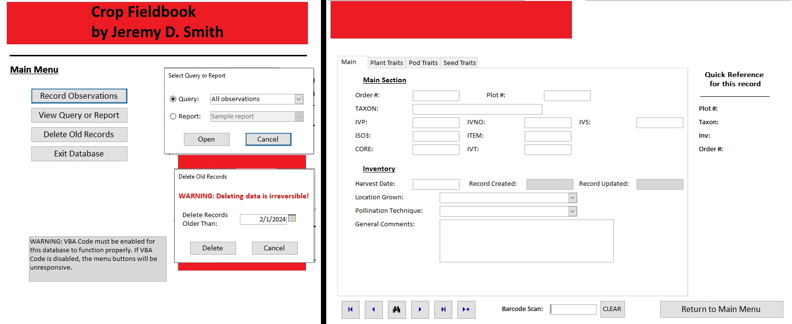

# zaydocFieldbook_Public

This is a Microsoft Access VBA app I created for a crop scientist to allow their field technicians to collect research data using tablets or laptops. Prior to this app, the technicians were recording observations on paper and then manually transferring that information to a computer when they returned to their offices. This app allowed those technicians to greatly reduce time spent on data collection and almost completely removed data entry errors.

I am presenting this project both for my portfolio and to help others who may be facing challenges creating similar projects.
